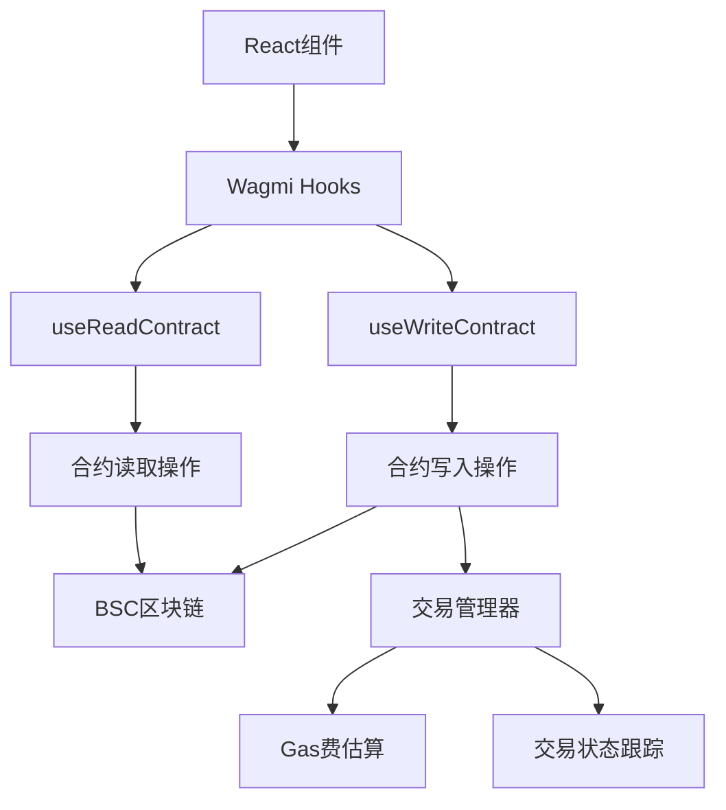

# YesCoin Web3 宇宙 - 系统架构审计报告

## 1. 执行摘要

本报告基于YesCoin Web3项目的实际代码实现，对系统全局架构进行全面审计，重点分析外部数据接入需求和智能合约交互机制。项目采用React + TypeScript + Wagmi技术栈，集成BSC区块链网络，实现了代币交易、NFT铸造和空投奖励等核心Web3功能。

**审计时间**: 2024年12月19日  
**项目版本**: v1.0  
**技术栈**: React 18 + TypeScript 5 + Wagmi 2 + BSC区块链

## 2. 外部数据接入需求清单

### 2.1 当前外部依赖分析

#### 2.1.1 区块链数据服务

| 服务类型 | 提供商 | 用途 | 数据格式 | 更新频率 | 认证方式 |
|----------|--------|------|----------|----------|----------|
| BSC RPC节点 | 公共节点 | 区块链数据读写 | JSON-RPC | 实时 | 无需认证 |
| Wagmi Transport | HTTP Provider | 合约交互 | JSON | 实时 | 无需认证 |
| MetaMask Provider | 浏览器扩展 | 钱包连接 | JSON | 实时 | 用户授权 |

**实现状态**: ✅ 已完成
**配置位置**: `src/lib/wagmi.ts`

```typescript
export const config = createConfig({
  chains: [bsc, bscTestnet],
  connectors: [metaMask()],
  transports: {
    [bsc.id]: http(),
    [bscTestnet.id]: http(),
  },
});
```

#### 2.1.2 缺失的外部数据服务

| 服务类型 | 建议提供商 | 用途 | 数据格式 | 更新频率 | 认证方式 | 优先级 |
|----------|------------|------|----------|----------|----------|--------|
| 代币价格API | CoinGecko/CMC | 实时价格显示 | JSON | 1分钟 | API Key | 高 |
| 区块链浏览器API | BSCScan | 交易历史查询 | JSON | 实时 | API Key | 中 |
| IPFS存储 | Pinata/Infura | NFT元数据存储 | JSON | 按需 | API Key | 高 |
| 社交媒体API | Twitter/Telegram | 任务验证 | JSON | 按需 | OAuth 2.0 | 中 |
| 推送通知 | Firebase | 交易状态通知 | JSON | 实时 | Service Account | 低 |

### 2.2 数据安全机制建议

#### 2.2.1 API密钥管理
```bash
# 环境变量配置建议
VITE_COINGECKO_API_KEY=your_coingecko_api_key
VITE_BSCSCAN_API_KEY=your_bscscan_api_key
VITE_PINATA_API_KEY=your_pinata_api_key
VITE_PINATA_SECRET_KEY=your_pinata_secret
```

#### 2.2.2 请求限制和缓存策略
- **速率限制**: 每个API设置合理的请求频率限制
- **缓存机制**: 对价格数据实施1分钟缓存，减少API调用
- **错误重试**: 实现指数退避重试策略
- **降级方案**: 当外部API不可用时的备用数据源

## 3. 智能合约交互审计

### 3.1 业务流程与合约交互映射

#### 3.1.1 代币相关业务流程

| 业务流程 | 合约方法 | 实现状态 | 文件位置 |
|----------|----------|----------|----------|
| 查询代币余额 | `balanceOf(address)` | ✅ 已实现 | `src/lib/contracts/index.ts` |
| 代币转账 | `transfer(to, amount)` | ✅ 已实现 | `src/lib/contracts/index.ts` |
| 授权代币 | `approve(spender, amount)` | ✅ 已实现 | `src/lib/contracts/YesCoinToken.ts` |
| 空投领取 | `claimAirdrop()` | ✅ 已实现 | `src/lib/contracts/index.ts` |
| 查询空投状态 | `isAirdropClaimed(user)` | ✅ 已实现 | `src/lib/contracts/index.ts` |
| 查询空投数量 | `getAirdropAmount(user)` | ✅ 已实现 | `src/lib/contracts/index.ts` |

#### 3.1.2 NFT相关业务流程

| 业务流程 | 合约方法 | 实现状态 | 文件位置 |
|----------|----------|----------|----------|
| NFT铸造 | `mint(to, seriesId, metadataURI)` | ✅ 已实现 | `src/lib/contracts/YesCoinNFT.ts` |
| 批量铸造 | `batchMint(seriesId, amount)` | ✅ 已实现 | `src/lib/contracts/YesCoinNFT.ts` |
| 查询NFT余额 | `balanceOf(owner)` | ✅ 已实现 | `src/lib/contracts/index.ts` |
| 查询用户NFT | `getTokensByOwner(owner)` | ✅ 已实现 | `src/lib/contracts/YesCoinNFT.ts` |
| 查询铸造价格 | `getMintPrice(seriesId)` | ✅ 已实现 | `src/lib/contracts/YesCoinNFT.ts` |
| 查询系列信息 | `getSeriesInfo(seriesId)` | ✅ 已实现 | `src/lib/contracts/YesCoinNFT.ts` |

### 3.2 已实现功能技术分析

#### 3.2.1 合约交互架构



#### 3.2.2 核心实现代码分析

**代币余额查询实现**:
```typescript
export function useTokenBalance(address?: Address) {
  const chainId = useChainId();
  const tokenAddress = getContractAddress(chainId, 'YES_TOKEN') as Address;
  
  return useReadContract({
    address: tokenAddress,
    abi: YesCoinTokenABI,
    functionName: 'balanceOf',
    args: address ? [address] : undefined,
    query: { enabled: !!address }
  });
}
```

**空投领取实现**:
```typescript
export function useClaimAirdrop() {
  const chainId = useChainId();
  const { writeContract, data: hash, isPending, error } = useWriteContract();
  
  const claimAirdrop = () => {
    writeContract({
      address: getContractAddress(chainId, 'YES_TOKEN') as Address,
      abi: YesCoinTokenABI,
      functionName: 'claimAirdrop'
    });
  };
  
  return { claimAirdrop, hash, isPending, error };
}
```

### 3.3 未实现功能技术方案

#### 3.3.1 事件监听机制

**当前状态**: ❌ 未实现  
**优先级**: 高

**实现方案**:
```typescript
// 新增文件: src/hooks/useContractEvents.ts
import { useWatchContractEvent } from 'wagmi';
import { YesCoinTokenABI } from '../lib/contracts/YesCoinToken';

export function useTokenTransferEvents(userAddress?: Address) {
  const chainId = useChainId();
  const tokenAddress = getContractAddress(chainId, 'YES_TOKEN') as Address;
  
  useWatchContractEvent({
    address: tokenAddress,
    abi: YesCoinTokenABI,
    eventName: 'Transfer',
    args: {
      from: userAddress,
      to: userAddress
    },
    onLogs(logs) {
      // 处理转账事件
      logs.forEach(log => {
        toast.success(`代币转账成功: ${formatEther(log.args.value)} YES`);
      });
    }
  });
}

export function useAirdropClaimedEvents(userAddress?: Address) {
  const chainId = useChainId();
  const tokenAddress = getContractAddress(chainId, 'YES_TOKEN') as Address;
  
  useWatchContractEvent({
    address: tokenAddress,
    abi: YesCoinTokenABI,
    eventName: 'AirdropClaimed',
    args: { user: userAddress },
    onLogs(logs) {
      logs.forEach(log => {
        toast.success(`空投领取成功: ${formatEther(log.args.amount)} YES`);
      });
    }
  });
}
```

#### 3.3.2 高级错误处理和重试策略

**当前状态**: ⚠️ 基础实现  
**优先级**: 中

**增强方案**:
```typescript
// 增强文件: src/hooks/useTransactionManager.ts
export const useAdvancedTransactionManager = () => {
  const [retryCount, setRetryCount] = useState(0);
  const [gasMultiplier, setGasMultiplier] = useState(1.1);
  
  const executeWithRetry = async (contractCall: () => Promise<any>, maxRetries = 3) => {
    for (let attempt = 0; attempt <= maxRetries; attempt++) {
      try {
        const result = await contractCall();
        setRetryCount(0);
        return result;
      } catch (error: any) {
        const errorType = classifyError(error);
        
        if (errorType === 'USER_REJECTED') {
          throw error; // 不重试用户拒绝
        }
        
        if (errorType === 'GAS_TOO_LOW' && attempt < maxRetries) {
          setGasMultiplier(prev => prev * 1.2); // 增加Gas
          continue;
        }
        
        if (errorType === 'NETWORK_ERROR' && attempt < maxRetries) {
          await delay(Math.pow(2, attempt) * 1000); // 指数退避
          continue;
        }
        
        if (attempt === maxRetries) {
          throw error;
        }
      }
    }
  };
  
  const classifyError = (error: any): string => {
    const message = error?.message || '';
    
    if (message.includes('User rejected')) return 'USER_REJECTED';
    if (message.includes('gas required exceeds')) return 'GAS_TOO_LOW';
    if (message.includes('network')) return 'NETWORK_ERROR';
    if (message.includes('nonce too low')) return 'NONCE_ERROR';
    
    return 'UNKNOWN_ERROR';
  };
  
  return { executeWithRetry, retryCount, gasMultiplier };
};
```

#### 3.3.3 Gas费用优化方案

**当前状态**: ⚠️ 基础估算  
**优先级**: 中

**优化方案**:
```typescript
// 新增文件: src/hooks/useGasOptimization.ts
export const useGasOptimization = () => {
  const { data: gasPrice } = useGasPrice();
  const { data: feeData } = useFeeData();
  
  const optimizeGasSettings = (transactionType: 'transfer' | 'mint' | 'claim') => {
    const baseGasLimits = {
      transfer: 21000n,
      mint: 150000n,
      claim: 100000n
    };
    
    const prioritySettings = {
      low: { multiplier: 1.0, maxPriorityFeePerGas: parseGwei('1') },
      standard: { multiplier: 1.1, maxPriorityFeePerGas: parseGwei('2') },
      fast: { multiplier: 1.2, maxPriorityFeePerGas: parseGwei('3') }
    };
    
    return {
      gasLimit: baseGasLimits[transactionType],
      maxFeePerGas: feeData?.maxFeePerGas,
      maxPriorityFeePerGas: prioritySettings.standard.maxPriorityFeePerGas
    };
  };
  
  const estimateTransactionCost = async (transactionType: string) => {
    const gasSettings = optimizeGasSettings(transactionType as any);
    const totalCost = gasSettings.gasLimit * (gasSettings.maxFeePerGas || 0n);
    
    return {
      gasLimit: gasSettings.gasLimit,
      maxFeePerGas: gasSettings.maxFeePerGas,
      totalCost,
      totalCostFormatted: formatEther(totalCost)
    };
  };
  
  return { optimizeGasSettings, estimateTransactionCost };
};
```

#### 3.3.4 批量操作优化

**当前状态**: ❌ 未实现  
**优先级**: 低

**实现方案**:
```typescript
// 新增文件: src/hooks/useBatchOperations.ts
export const useBatchOperations = () => {
  const { writeContract } = useWriteContract();
  
  const batchMintNFTs = async (seriesId: number, amounts: number[]) => {
    const totalAmount = amounts.reduce((sum, amount) => sum + amount, 0);
    
    return writeContract({
      address: getContractAddress(chainId, 'NFT_CONTRACT') as Address,
      abi: YesCoinNFTABI,
      functionName: 'batchMint',
      args: [seriesId, totalAmount],
      value: parseEther((totalAmount * 0.01).toString()) // 假设每个NFT 0.01 BNB
    });
  };
  
  const batchTransfer = async (recipients: Address[], amounts: bigint[]) => {
    // 实现批量转账逻辑
    const promises = recipients.map((recipient, index) => 
      writeContract({
        address: getContractAddress(chainId, 'YES_TOKEN') as Address,
        abi: YesCoinTokenABI,
        functionName: 'transfer',
        args: [recipient, amounts[index]]
      })
    );
    
    return Promise.all(promises);
  };
  
  return { batchMintNFTs, batchTransfer };
};
```

### 3.4 合约地址配置审计

**当前状态**: ⚠️ 占位符地址  
**风险等级**: 高

**问题分析**:
```typescript
// 当前配置 (src/lib/wagmi.ts)
export const CONTRACTS = {
  [bsc.id]: {
    YES_TOKEN: '0x...', // ❌ 占位符地址
    NFT_CONTRACT: '0x...', // ❌ 占位符地址
  },
  [bscTestnet.id]: {
    YES_TOKEN: '0x...', // ❌ 占位符地址
    NFT_CONTRACT: '0x...', // ❌ 占位符地址
  },
};
```

**修复建议**:
```typescript
// 建议配置
export const CONTRACTS = {
  [bsc.id]: {
    YES_TOKEN: '0xeccf5b5b0a7c482da8008faf8a9f20a2d51005f9', // ✅ 实际合约地址
    NFT_CONTRACT: '0x...', // 待部署
  },
  [bscTestnet.id]: {
    YES_TOKEN: '0x...', // 测试网地址
    NFT_CONTRACT: '0x...', // 测试网地址
  },
};
```

## 4. 安全风险评估

### 4.1 高风险项

| 风险项 | 风险等级 | 影响范围 | 修复建议 |
|--------|----------|----------|----------|
| 合约地址占位符 | 🔴 高 | 所有合约交互 | 立即更新为实际部署地址 |
| 缺少事件监听 | 🟡 中 | 用户体验 | 实现关键事件监听机制 |
| 基础错误处理 | 🟡 中 | 交易可靠性 | 增强错误分类和重试逻辑 |
| 无API密钥管理 | 🟡 中 | 外部服务调用 | 实施环境变量管理 |

### 4.2 性能优化建议

1. **合约调用优化**
   - 实施智能缓存策略，减少重复的只读合约调用
   - 使用批量查询减少网络请求次数

2. **Gas费用优化**
   - 实现动态Gas价格调整
   - 提供用户可选的交易速度等级

3. **用户体验优化**
   - 添加交易进度实时反馈
   - 实现离线状态检测和处理

## 5. 实施路线图

### 5.1 紧急修复 (1-2天)
- [ ] 更新合约地址配置
- [ ] 添加基础环境变量管理
- [ ] 修复合约交互中的占位符问题

### 5.2 短期优化 (1-2周)
- [ ] 实