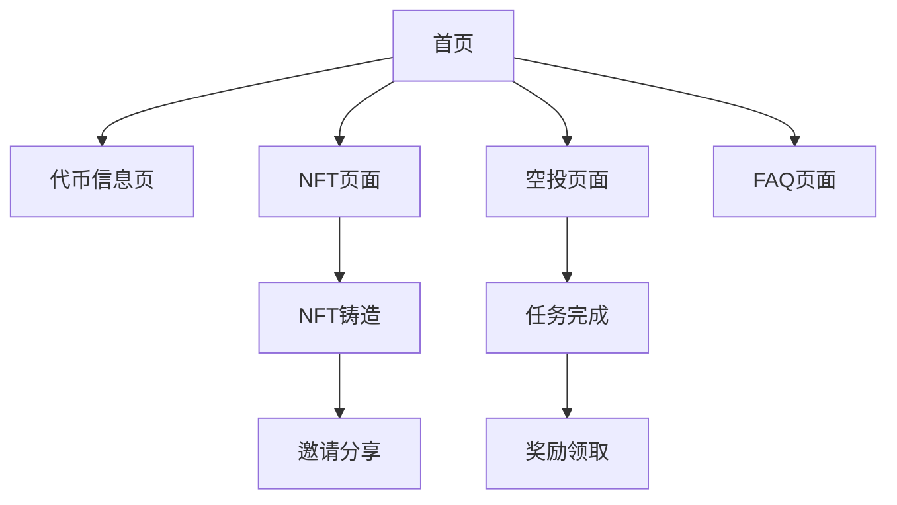

# YesCoin Web3 宇宙 - 产品需求文档

## 1. 产品概览

YesCoin Web3 宇宙是一个以街头涂鸦文化为主题的去中心化应用(DApp)，结合代币经济、NFT收藏和社群互动功能。

项目旨在通过街头艺术文化连接Web3用户，提供代币交易、NFT铸造和空投奖励等功能，打造独特的迷因币生态系统。

目标是建立一个公平、自由、以社群为核心的Web3文化平台，吸引街头文化爱好者和加密货币投资者。

## 2. 核心功能

### 2.1 用户角色

| 角色 | 注册方式 | 核心权限 |
|------|----------|----------|
| 普通用户 | 钱包连接(MetaMask等) | 浏览内容、查看代币信息、参与空投任务 |
| 持币用户 | 钱包连接+持有YES代币 | 铸造NFT、获得空投奖励、参与社群治理 |
| NFT持有者 | 钱包连接+持有街头艺术NFT | 专属权益、邀请奖励、优先参与活动 |

### 2.2 功能模块

我们的YesCoin Web3宇宙包含以下主要页面：

1. **首页**: 英雄区块、导航菜单、数据统计展示、功能特色介绍、发展路线图、团队介绍
2. **代币信息页**: 代币概览、市场指标、价格图表、白皮书链接
3. **NFT页面**: NFT画廊展示、铸造功能、进度条、邀请系统
4. **空投页面**: 任务列表、完成状态、奖励领取
5. **FAQ页面**: 常见问题折叠展示、详细解答

### 2.3 页面详情

| 页面名称 | 模块名称 | 功能描述 |
|----------|----------|----------|
| 首页 | 英雄区块 | 显示YesCoin品牌标题、副标题和主要行动按钮，支持多语言切换 |
| 首页 | 导航菜单 | 提供页面跳转链接、钱包连接按钮、语言切换按钮 |
| 首页 | 数据统计 | 展示持币地址数量、总市值、已铸造NFT数量、空投参与者数量 |
| 首页 | 功能特色 | 介绍项目四大核心理念：绝对公平、引爆文化、自由万岁、社群为王 |
| 首页 | 发展路线图 | 展示四个阶段的发展计划和里程碑 |
| 首页 | 团队介绍 | 展示核心团队成员头像、姓名和职责 |
| 代币信息页 | 代币概览 | 显示代币名称、符号、区块链、总供应量等基本信息 |
| 代币信息页 | 市场指标 | 实时显示当前价格、市值、持有者数量、流通供应量 |
| 代币信息页 | 白皮书链接 | 提供白皮书下载或查看入口 |
| NFT页面 | NFT画廊 | 横向滚动展示不同系列的街头艺术NFT作品 |
| NFT页面 | 铸造功能 | 显示铸造进度、价格、数量选择器和铸造按钮 |
| NFT页面 | 邀请系统 | 提供邀请链接生成、奖励说明和邀请统计 |
| 空投页面 | 任务列表 | 展示Twitter关注、转发、Telegram加入等任务 |
| 空投页面 | 任务验证 | 检查用户完成状态并提供验证机制 |
| 空投页面 | 奖励领取 | 显示可领取奖励数量和领取按钮 |
| FAQ页面 | 问题展示 | 折叠式问答列表，支持点击展开详细内容 |

## 3. 核心流程

**普通用户流程：**
用户访问网站 → 浏览项目信息 → 连接钱包 → 查看代币信息 → 参与空投任务 → 获得奖励

**NFT铸造流程：**
用户连接钱包 → 进入NFT页面 → 浏览NFT画廊 → 选择铸造数量 → 支付BNB → 获得NFT → 分享邀请链接

**空投参与流程：**
用户连接钱包 → 进入空投页面 → 完成社交媒体任务 → 验证任务完成 → 领取代币奖励

## 4. 用户界面设计

### 4.1 设计风格

- **主色调**: 深色砖墙背景(#282828)，浅灰色文字(#EAEAEA)
- **强调色**: 黄色喷漆(#FFF500)，粉色喷漆(#FF0077)，青色喷漆(#00FFFF)
- **按钮风格**: 3D涂鸦风格，带边框和悬停动画效果
- **字体**: 英文使用Bangers字体，中文使用Noto Sans SC加粗
- **布局风格**: 卡片式布局，轻微旋转角度营造涂鸦感
- **图标风格**: 像素化风格，街头文化emoji

### 4.2 页面设计概览

| 页面名称 | 模块名称 | UI元素 |
|----------|----------|--------|
| 首页 | 英雄区块 | 大号涂鸦字体标题，渐变色彩效果，霓虹发光阴影，居中布局 |
| 首页 | 导航菜单 | 顶部固定导航，下划线悬停效果，右侧按钮组 |
| 首页 | 数据卡片 | 网格布局，旋转角度，粉色数字强调，深色半透明背景 |
| 首页 | 功能特色 | 四列网格，大号emoji图标，涂鸦标题字体 |
| 代币信息页 | 信息卡片 | 左右分栏布局，关键指标使用小卡片展示，黄色强调色 |
| NFT页面 | 画廊展示 | 横向滚动容器，卡片式NFT展示，自定义滚动条样式 |
| NFT页面 | 铸造界面 | 进度条显示，价格突出显示，数量输入框，大号铸造按钮 |
| 空投页面 | 任务列表 | 垂直排列任务卡片，完成状态图标，领取按钮 |
| FAQ页面 | 折叠问答 | details/summary标签实现，旋转图标动画 |

### 4.3 响应式设计

产品采用移动优先的响应式设计，支持桌面端、平板和手机端访问。

- 桌面端：完整功能展示，多列网格布局
- 平板端：适配中等屏幕，调整网格列数
- 手机端：单列布局，隐藏部分导航元素，优化触摸交互

所有交互元素针对触摸设备进行优化，按钮大小符合移动端点击标准。