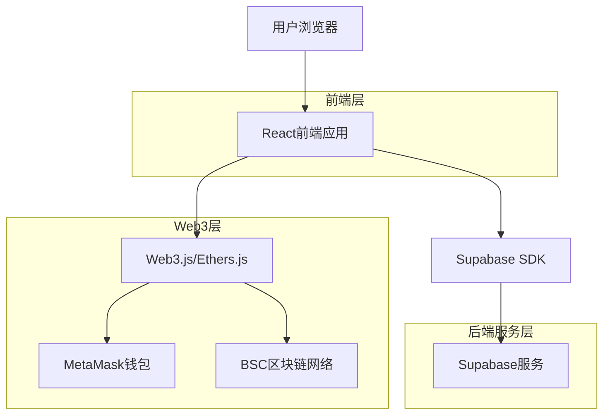
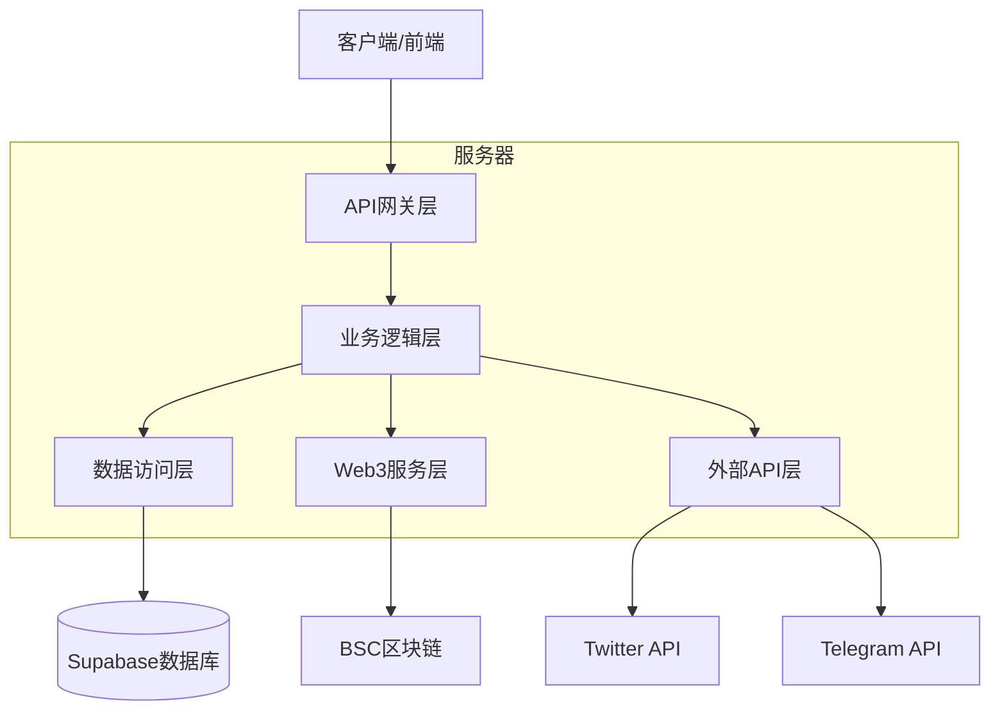
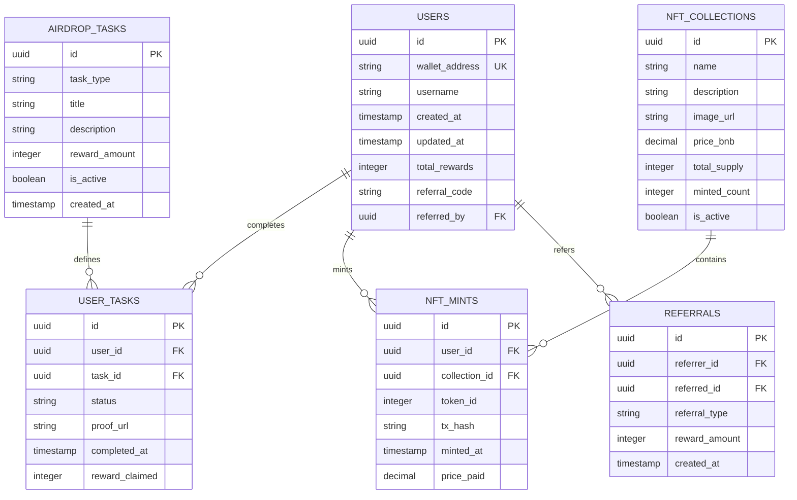

# YesCoin Web3 宇宙 - 技术架构文档

## 1. 架构设计



## 2. 技术描述

- 前端: React@18 + TypeScript@5 + Tailwind CSS@3 + Vite@5
- Web3集成: ethers.js@6 + wagmi@2 + viem@2
- 状态管理: Zustand@4
- 路由: React Router@6
- UI组件: Headless UI + Radix UI
- 后端服务: Supabase (数据库 + 认证 + 存储)

## 3. 路由定义

| 路由 | 用途 |
|------|------|
| / | 首页，展示项目介绍、数据统计、功能特色等主要内容 |
| /token | 代币信息页，显示YES代币的详细信息和市场数据 |
| /nft | NFT页面，展示街头艺术NFT画廊和铸造功能 |
| /airdrop | 空投页面，显示任务列表和奖励领取功能 |
| /faq | FAQ页面，提供常见问题解答 |

## 4. API定义

### 4.1 核心API

**用户认证相关**
```
POST /api/auth/wallet
```

请求:
| 参数名 | 参数类型 | 是否必需 | 描述 |
|--------|----------|----------|------|
| address | string | true | 钱包地址 |
| signature | string | true | 签名信息 |
| message | string | true | 签名消息 |

响应:
| 参数名 | 参数类型 | 描述 |
|--------|----------|------|
| success | boolean | 认证状态 |
| token | string | JWT令牌 |
| user | object | 用户信息 |

**NFT铸造相关**
```
POST /api/nft/mint
```

请求:
| 参数名 | 参数类型 | 是否必需 | 描述 |
|--------|----------|----------|------|
| address | string | true | 用户钱包地址 |
| amount | number | true | 铸造数量 |
| txHash | string | true | 交易哈希 |

响应:
| 参数名 | 参数类型 | 描述 |
|--------|----------|------|
| success | boolean | 铸造状态 |
| tokenIds | number[] | NFT代币ID列表 |

**空投任务相关**
```
POST /api/airdrop/verify
```

请求:
| 参数名 | 参数类型 | 是否必需 | 描述 |
|--------|----------|----------|------|
| address | string | true | 用户钱包地址 |
| taskType | string | true | 任务类型 (twitter_follow, twitter_retweet, telegram_join) |
| proof | string | true | 完成证明 |

响应:
| 参数名 | 参数类型 | 描述 |
|--------|----------|------|
| success | boolean | 验证状态 |
| reward | number | 奖励数量 |

示例:
```json
{
  "address": "0x742d35Cc6634C0532925a3b8D4C9db96",
  "taskType": "twitter_follow",
  "proof": "https://twitter.com/user/status/123456789"
}
```

## 5. 服务器架构图



## 6. 数据模型

### 6.1 数据模型定义



### 6.2 数据定义语言

**用户表 (users)**
```sql
-- 创建用户表
CREATE TABLE users (
    id UUID PRIMARY KEY DEFAULT gen_random_uuid(),
    wallet_address VARCHAR(42) UNIQUE NOT NULL,
    username VARCHAR(50),
    created_at TIMESTAMP WITH TIME ZONE DEFAULT NOW(),
    updated_at TIMESTAMP WITH TIME ZONE DEFAULT NOW(),
    total_rewards INTEGER DEFAULT 0,
    referral_code VARCHAR(10) UNIQUE,
    referred_by UUID REFERENCES users(id)
);

-- 创建索引
CREATE INDEX idx_users_wallet_address ON users(wallet_address);
CREATE INDEX idx_users_referral_code ON users(referral_code);

-- 权限设置
GRANT SELECT ON users TO anon;
GRANT ALL PRIVILEGES ON users TO authenticated;
```

**NFT集合表 (nft_collections)**
```sql
-- 创建NFT集合表
CREATE TABLE nft_collections (
    id UUID PRIMARY KEY DEFAULT gen_random_uuid(),
    name VARCHAR(100) NOT NULL,
    description TEXT,
    image_url TEXT,
    price_bnb DECIMAL(10,6) NOT NULL,
    total_supply INTEGER NOT NULL,
    minted_count INTEGER DEFAULT 0,
    is_active BOOLEAN DEFAULT true,
    created_at TIMESTAMP WITH TIME ZONE DEFAULT NOW()
);

-- 权限设置
GRANT SELECT ON nft_collections TO anon;
GRANT ALL PRIVILEGES ON nft_collections TO authenticated;

-- 初始化数据
INSERT INTO nft_collections (name, description, price_bnb, total_supply) VALUES
('水泥墙系列', '街头水泥墙涂鸦艺术NFT', 0.05, 10000),
('红砖墙系列', '经典红砖墙涂鸦作品', 0.05, 10000),
('纸板系列', '废弃纸板上的艺术创作', 0.05, 10000),
('木板系列', '木质表面涂鸦艺术', 0.05, 10000),
('金属板系列', '金属表面街头艺术', 0.05, 10000),
('牛皮纸系列', '牛皮纸材质涂鸦作品', 0.05, 5315);
```

**NFT铸造记录表 (nft_mints)**
```sql
-- 创建NFT铸造记录表
CREATE TABLE nft_mints (
    id UUID PRIMARY KEY DEFAULT gen_random_uuid(),
    user_id UUID NOT NULL REFERENCES users(id),
    collection_id UUID NOT NULL REFERENCES nft_collections(id),
    token_id INTEGER NOT NULL,
    tx_hash VARCHAR(66) NOT NULL,
    minted_at TIMESTAMP WITH TIME ZONE DEFAULT NOW(),
    price_paid DECIMAL(10,6) NOT NULL
);

-- 创建索引
CREATE INDEX idx_nft_mints_user_id ON nft_mints(user_id);
CREATE INDEX idx_nft_mints_tx_hash ON nft_mints(tx_hash);

-- 权限设置
GRANT SELECT ON nft_mints TO anon;
GRANT ALL PRIVILEGES ON nft_mints TO authenticated;
```

**空投任务表 (airdrop_tasks)**
```sql
-- 创建空投任务表
CREATE TABLE airdrop_tasks (
    id UUID PRIMARY KEY DEFAULT gen_random_uuid(),
    task_type VARCHAR(50) NOT NULL,
    title VARCHAR(200) NOT NULL,
    description TEXT,
    reward_amount INTEGER NOT NULL,
    is_active BOOLEAN DEFAULT true,
    created_at TIMESTAMP WITH TIME ZONE DEFAULT NOW()
);

-- 权限设置
GRANT SELECT ON airdrop_tasks TO anon;
GRANT ALL PRIVILEGES ON airdrop_tasks TO authenticated;

-- 初始化任务数据
INSERT INTO airdrop_tasks (task_type, title, description, reward_amount) VALUES
('twitter_follow', '关注官方Twitter', '关注@YesCoinOfficial获得奖励', 1000000),
('twitter_retweet', '转发推文', '转发置顶推文并@3个朋友', 500000),
('telegram_join', '加入Telegram群', '加入官方Telegram社群', 1000000);
```

**用户任务完成记录表 (user_tasks)**
```sql
-- 创建用户任务完成记录表
CREATE TABLE user_tasks (
    id UUID PRIMARY KEY DEFAULT gen_random_uuid(),
    user_id UUID NOT NULL REFERENCES users(id),
    task_id UUID NOT NULL REFERENCES airdrop_tasks(id),
    status VARCHAR(20) DEFAULT 'pending',
    proof_url TEXT,
    completed_at TIMESTAMP WITH TIME ZONE,
    reward_claimed INTEGER DEFAULT 0,
    UNIQUE(user_id, task_id)
);

-- 创建索引
CREATE INDEX idx_user_tasks_user_id ON user_tasks(user_id);
CREATE INDEX idx_user_tasks_status ON user_tasks(status);

-- 权限设置
GRANT SELECT ON user_tasks TO anon;
GRANT ALL PRIVILEGES ON user_tasks TO authenticated;
```

**推荐关系表 (referrals)**
```sql
-- 创建推荐关系表
CREATE TABLE referrals (
    id UUID PRIMARY KEY DEFAULT gen_random_uuid(),
    referrer_id UUID NOT NULL REFERENCES users(id),
    referred_id UUID NOT NULL REFERENCES users(id),
    referral_type VARCHAR(20) NOT NULL,
    reward_amount INTEGER NOT NULL,
    created_at TIMESTAMP WITH TIME ZONE DEFAULT NOW()
);

-- 创建索引
CREATE INDEX idx_referrals_referrer_id ON referrals(referrer_id);
CREATE INDEX idx_referrals_referred_id ON referrals(referred_id);

-- 权限设置
GRANT SELECT ON referrals TO anon;
GRANT ALL PRIVILEGES ON referrals TO authenticated;
```